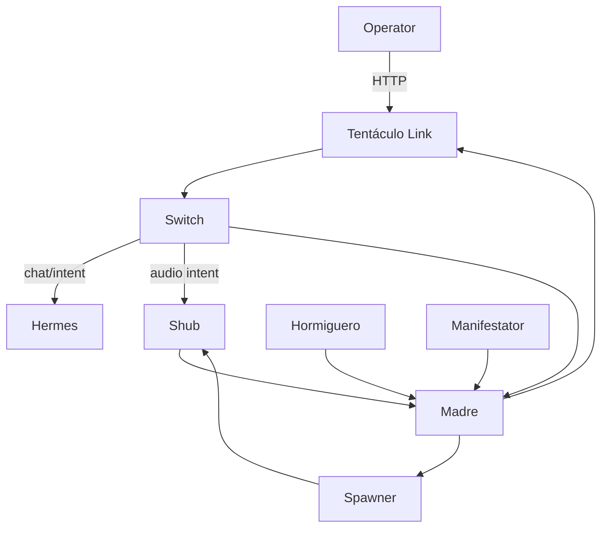
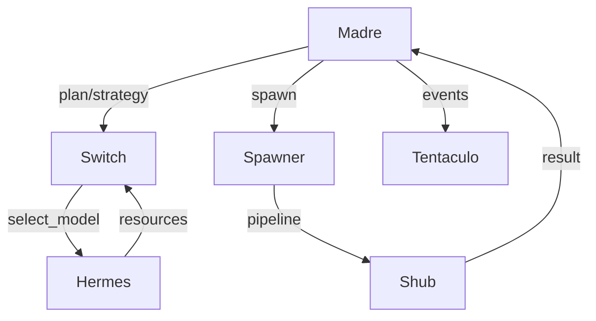

# VX11 v5.0 — ARCHITECTURE

## Overview

VX11 es un **sistema de orquestación modular, autónomo y ultra-low-memory** diseñado para entornos con restricciones de recursos. Utiliza 8 microservicios independientes coordinados por un **frontdoor único (Tentáculo Link, alias DNS `gateway`)** que facilita la comunicación entre módulos.

### Visión General

```
┌─────────────────────────────────────────────────────┐
│           VX11 v5.0 Modular Architecture            │
├─────────────────────────────────────────────────────┤
│                                                       │
│  Tentáculo Link (8000, alias gateway) — Frontdoor / API Principal │
│    ├─ Madre (8001) — Orquestación de tareas         │
│    ├─ Switch (8002) — Router IA / Selección         │
│    ├─ Hermes (8003) — CLI + Descubrimiento HF       │
│    ├─ Hormiguero (8004) — Paralelización            │
│    ├─ Manifestator (8005) — Auditoría + Parches     │
│    ├─ MCP (8006) — Conversacional                   │
│    └─ Shub Niggurath (8007) — Procesamiento          │
│                                                       │
│  Persistencia: SQLite (/app/data/*.db)              │
│  Memoria: Ultra-low-memory (512MB/contenedor)       │
│  Red: Docker (vx11-network)                         │
│  Volúmenes: logs/, models/, sandbox/, data/         │
│                                                       │
└─────────────────────────────────────────────────────┘
```

---

## Módulos

### 1. **Tentáculo Link (frontdoor, alias `gateway`)** (Puerto 8000)

- **Rol:** Punto de entrada único. Orquestador/forwarder de rutas.
- **Responsabilidades:**
  - Reenvío de solicitudes HTTP/WebSocket a módulos según `target`.
  - Control de autenticación (token `X-VX11-Token`).
  - Exposición de `/vx11/status` (estado del sistema).
  - Health agregador (`/health`).
- **Endpoints clave:**
  - `GET /health` → estado del frontdoor
- `GET /vx11/status` → puertos y módulos disponibles
- `POST /vx11/orchestrate` → orquestación rápida vía Switch/Hermes/Madre/Hormiguero/MCP/Shub/Spawner

### Flujos VX11 v6.7 (texto/mermaid)





### Flujo resumido (v6.7)
- Switch puntúa intents y deriva a Hermes o Shub (audio) con breaker.
- Hermes gestiona modelos locales (TTL + límite 30) y puede delegar a Shub.
- Madre planifica, consulta Switch, delega en Spawner y notifica por Tentáculo Link.
- Hormiguero reporta incidentes y puede consultar Manifestator ante drift.

### 2. **Madre** (Puerto 8001)

- **Rol:** Orquestador de tareas y toma de decisiones autónoma.
- **Responsabilidades:**
  - Crear y gestionar `Task` (persistentes en BD).
  - Ciclo autónomo de razonamiento cada ~30s (si activado).
  - Delegar a Switch (selección de provider), Hermes (ejecución), Hormiguero (paralelización), Manifestator (auditoría).
  - Registrar `IADecision` y `Reports` en BD.
- **Endpoints clave:**
  - `POST /task` → crear tarea
  - `GET /tasks` → listar tareas
  - `GET /health`
  - `POST /madre/v3/autonomous/start` → iniciar ciclo autónomo
  - `POST /madre/v3/autonomous/stop` → detener ciclo

### 3. **Switch** (Puerto 8002)

- **Rol:** Router inteligente de providers y modelos IA.
- **Responsabilidades:**
  - Scoring y selección de providers (DeepSeek, local, Hermes, etc.).
  - Reemplazo automático de modelos si se exceden límites.
  - Persistencia de decisiones (`IADecision` en BD).
  - Aprendizaje (Learner) de preferencias por tipo de tarea.
- **Endpoints clave:**
  - `GET /switch/providers` → providers disponibles + métricas
  - `POST /switch/route` → elegir provider para prompt
  - `GET /health`

### 4. **Hermes** (Puerto 8003)

- **Rol:** Ejecutor de CLIs y descubridor de modelos HuggingFace.
- **Responsabilidades:**
  - Scan de CLIs disponibles (~50+).
  - Detección de herramientas en el sistema.
  - Descubrimiento automático de modelos HF.
  - Descarga y cacheo de modelos (respetando límites).
  - Ejecución de comandos con protecciones.
- **Endpoints clave:**
  - `POST /hermes/exec` → ejecutar CLI
  - `GET /hermes/available` → CLIs detectados
  - `GET /hermes/jobs` → jobs en ejecución
  - `GET /health`

### 5. **Hormiguero** (Puerto 8004)

- **Rol:** Paralelización y distribución de tareas.
- **Responsabilidades:**
  - Modelo de reina + hormigas (obreras worker-pool).
  - Escalado y reducción automático de workers.
  - Distribución de subtareas.
  - Métricas de paralelismo.
- **Endpoints clave:**
  - `POST /hormiguero/task` → crear tarea paralela
  - `GET /hormiguero/status` → estado de la colonia
  - `GET /health`

### 6. **Manifestator** (Puerto 8005)

- **Rol:** Auditoría de drift, generación y aplicación de parches.
- **Responsabilidades:**
  - Escaneo de módulos y comparación con baseline.
  - Generación de parches (con sugerencias IA).
  - Aplicación controlada de parches.
  - Rollback automático si falla validación.
  - Registro de cambios.
- **Endpoints clave:**
  - `GET /drift` → detectar cambios
  - `POST /generate-patch` → generar parche
  - `POST /apply-patch` → aplicar cambios
  - `GET /health`

### 7. **MCP** (Puerto 8006)

- **Rol:** Interfaz conversacional y orquestación de acciones.
- **Responsabilidades:**
  - Procesamiento de intenciones conversacionales.
  - Delegación de acciones a otros módulos.
  - Contexto conversacional persistente.
  - Integración con Copilot/assistentes.
- **Endpoints clave:**
  - `POST /mcp/chat` → enviar mensaje
  - `POST /mcp/action` → ejecutar acción
  - `GET /health`

### 8. **Shub Niggurath** (Puerto 8007)

- **Rol:** Procesamiento avanzado y generación IA.
- **Responsabilidades:**
  - Pipeline de procesamiento de archivos.
  - Generación de contenido IA.
  - Integración de modelos especializados.
  - Procesamiento de audio/video (framework, no implementado).
- **Endpoints clave:**
  - `POST /shub/process` → procesar input
  - `POST /shub/generate` → generar contenido
  - `GET /health`

---

## Persistencia

### Bases de Datos SQLite

```
./data/
├── madre.db           # Tasks, Context, Reports, Spawns, IADecision, ModuleHealth
├── hermes.db          # CLI Registry, Model Registry, Scan logs
├── hive.db            # Compartida: model_registry, cli_registry, ia_decisions
└── vx11_test.db       # Tests: queen_tasks, ants, vx11_events
```

### Tablas Principales

- `tasks` — tareas creadas por Madre, referencias UUID UNIQUE
- `ia_decisions` — decisiones de Switch, scoring, latencia
- `model_registry` — modelos HF descargados, disponibilidad
- `cli_registry` — CLIs detectados por Hermes
- `module_health` — estado de cada módulo
- `context` — contexto global y por sesión
- `reports` — reportes de ejecución, métricas
- `spawns` — procesos efímeros (si integrado)

---

## Configuración

### settings.py

```python
# Puertos: 8000–8007
gateway_port = 8000
madre_port = 8001
switch_port = 8002
hermes_port = 8003
hormiguero_port = 8004
manifestator_port = 8005
mcp_port = 8006
shub_port = 8007

# Rutas internas (Docker)
BASE_PATH = "/app"
LOGS_PATH = "/app/logs"
MODELS_PATH = "/app/models"
SANDBOX_PATH = "/app/sandbox"
DATA_PATH = "/app/data"

# Ultra-low-memory
ULTRA_LOW_MEMORY = True
max_memory_mb = 512
max_model_size_mb = 256
cache_ttl_seconds = 300
```

### Environment

Ver `.env.example` y `tokens.env.sample` para variables completas.

---

## Docker & Deployment

### docker-compose.yml

- 8 servicios, cada uno con imagen slim Python 3.11.
- Volúmenes persistentes: `logs/`, `data/`, `models/`, `sandbox/`.
- Network: `vx11-network` (comunicación inter-módulo).
- Health checks: todos en `/health`, intervalo 30s.
- Límites de memoria: 512MB por contenedor.

### Build & Run

```bash
docker-compose build --no-cache
docker-compose up -d
docker-compose logs -f
```

---

## Ciclos Autónomos

### Madre: Autonomous Loop (v3)

Cada 30 segundos (si habilitado):

1. **Observe**: recolectar estado (tareas, contexto, disponibilidad).
2. **Reason**: usar Switch + IA para decidir acción.
3. **Decide**: elegir qué hacer (create_task, escalate, optimize).
4. **Delegate**: enviar a Switch (selección), Hermes (ejecutar), Hormiguero (paralela), Manifestator (auditar).
5. **Report**: guardar en BD (`IADecision`, `reports`).

### Switch: Decision Learning

- Registra cada llamada en `ia_decisions`.
- Scoring: latencia, éxito, confianza.
- Learner: aprende preferencias por `task_type`.
- Reemplazo: intercambia modelos si superan umbrales de memoria.

### Manifestator: Auto-Patch Cycle

- Cada N minutos: comparar módulos.
- Detectar drift → generar patch (con IA si procede).
- Validar con tests → aplicar (o rollback).

---

## Ultra-Low-Memory Mode

### Límites

- 512MB por contenedor.
- 256MB max por modelo descargado.
- Limpieza automática de caché cada 300s.

### Estrategias

- Lazy loading de modelos.
- Evicción LRU de contexto en memoria.
- Compactación de logs.
- Descarga de modelos no usados.

---

## Integración Copilot + VS Code

### MCP (Model Context Protocol)

- Exposición de endpoints como "herramientas" para Copilot Chat.
- Manifests en `.vscode/` si está integrado.

### Manifestator desde VS Code

Ver `docs/DEVELOPMENT.md` para:
- Comandos VS Code que invocan Manifestator.
- Ejemplos de curl.
- Prompts de Chat para auditoria.

---

## Seguridad

- Token por defecto: `vx11-token-production` (cambiar en producción).
- CORS: abierto en dev (`*`), restringir en prod.
- Secrets: `tokens.env` (no comitear).
- BD: SQLite local (considerando migración a PostgreSQL en prod si escala).

---

## Estructura de Directorios

```
/home/elkakas314/vx11/
├── config/                    # Configuración global
│   ├── settings.py
│   ├── db_schema.py
│   ├── deepseek.py
│   ├── tokens.py
│   ├── forensics.py
│   └── module_template.py
├── gateway/                   # Puerto 8000
├── madre/                     # Puerto 8001
├── switch/                    # Puerto 8002
├── hermes/                    # Puerto 8003
├── hormiguero/                # Puerto 8004
├── manifestator/              # Puerto 8005
├── mcp/                       # Puerto 8006
├── shubniggurath/             # Puerto 8007
├── scripts/                   # Utilities
├── tests/                     # Unit tests
├── docs/                      # Documentación
├── logs/                      # Logs por módulo (volumen Docker)
├── data/                      # BD SQLite (volumen Docker)
├── models/                    # Modelos HF (volumen Docker)
├── sandbox/                   # Ejecutables temp (volumen Docker)
├── docker-compose.yml
├── requirements.txt
├── .env.example
├── tokens.env.sample
└── .gitignore
```

---

## Próximos Pasos

1. Ver `docs/API_REFERENCE.md` para endpoints completos.
2. Ver `docs/DEVELOPMENT.md` para guía de desarrollo local.
3. Ver `docs/FLOWS.md` para 10 diagramas de flujo detallados.
4. Levantar sistema: `docker-compose up -d`.
5. Health check: `curl http://localhost:8000/health`.

---

**VX11 v5.0 — Sistema modular, autónomo y eficiente en memoria.**
