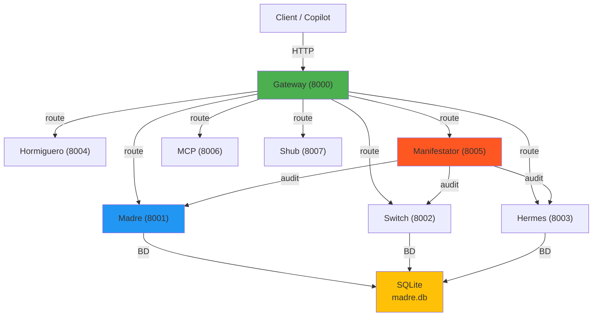
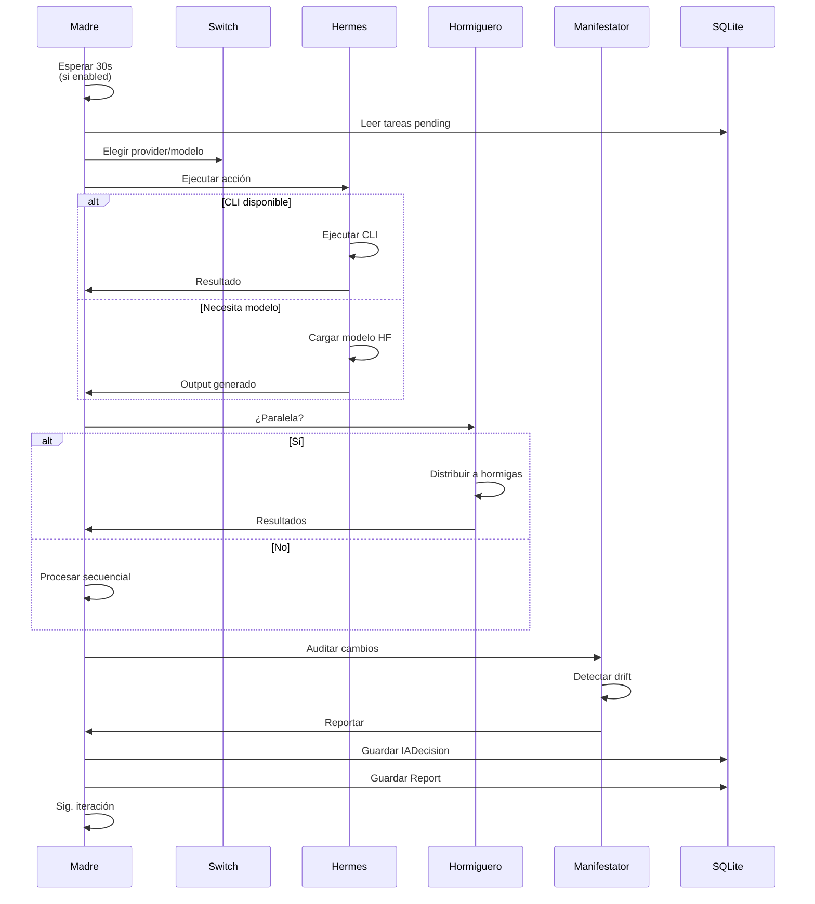
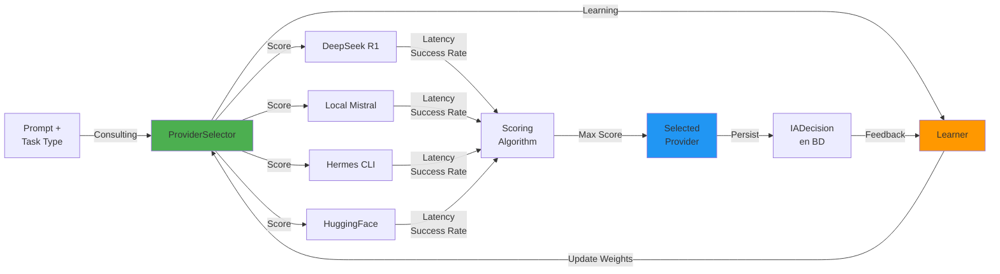
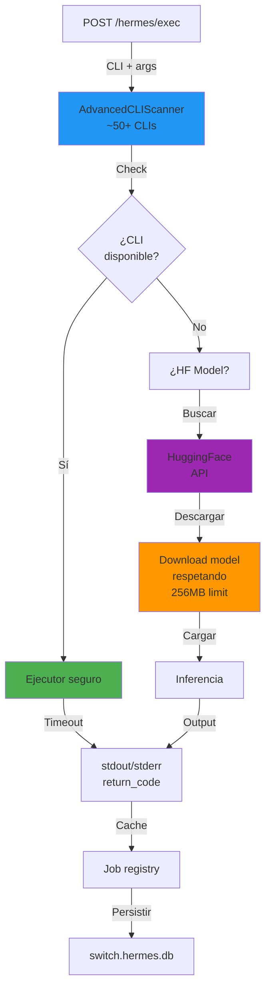
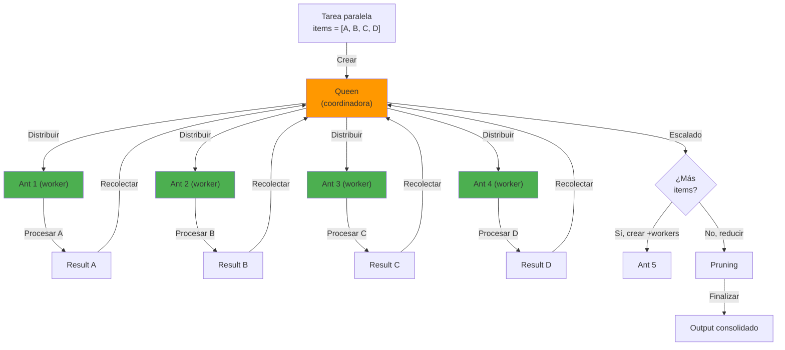
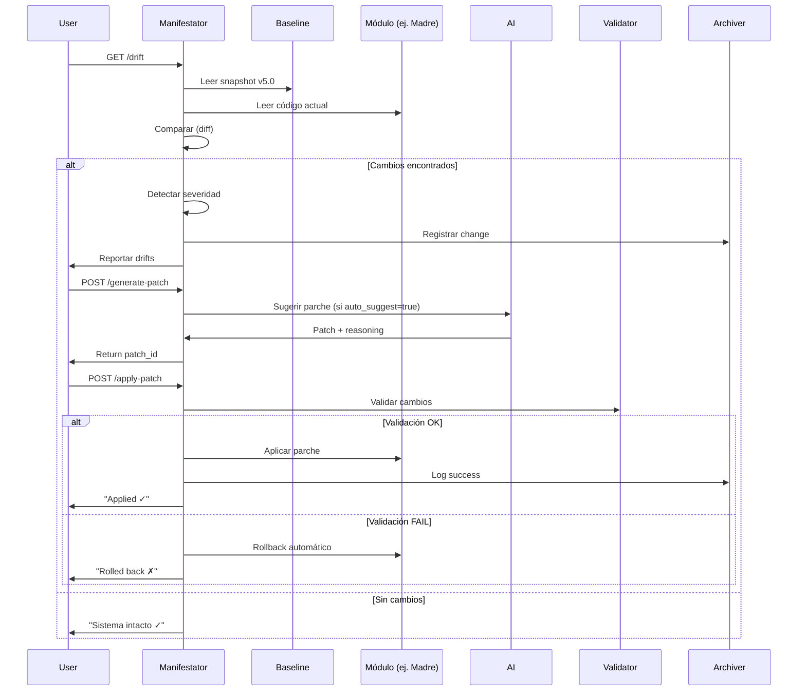
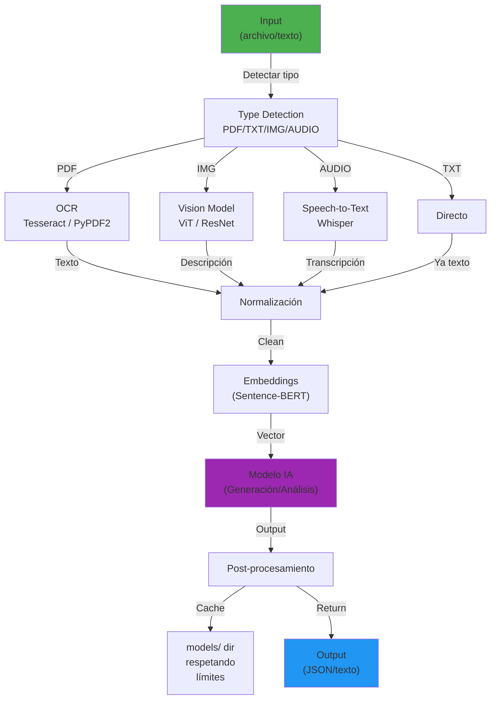
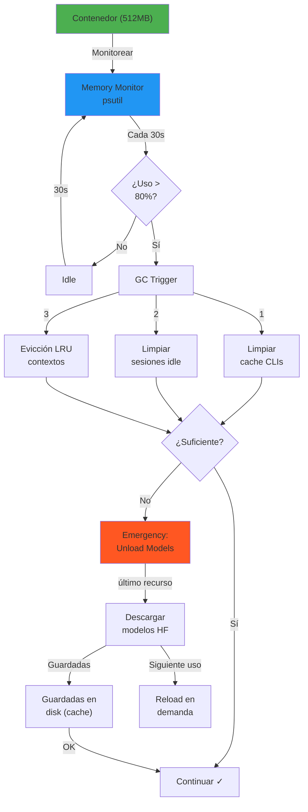
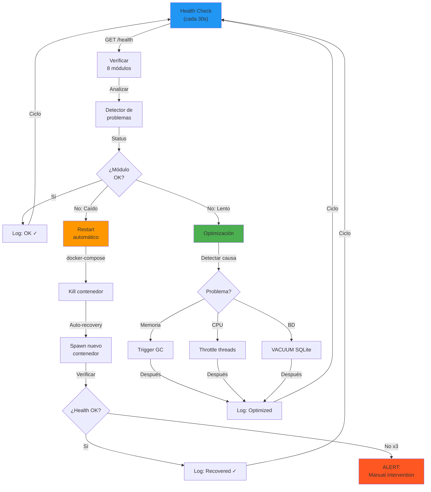

# VX11 v5.0 — FLOWS & DIAGRAMS

## Flujo 1: Arquitectura Global VX11



---

## Flujo 2: Ciclo Autónomo Madre (v3)



---

## Flujo 3: Switch — Selección y Scoring



---

## Flujo 4: Hermes — Ejecución de CLIs + Auto-Discovery



---

## Flujo 5: Hormiguero — Queen + Ants Paralelización



---

## Flujo 6: Manifestator — Drift Detect + Auto-Patch



---

## Flujo 7: Shub Niggurath — Pipeline IA



---

## Flujo 8: MCP — Conversación + Orquestación de Acciones

```mermaid
sequenceDiagram
    participant Copilot
    participant MCP
    participant Madre
    participant Switch
    participant Hermes
    participant ContextDB
    
    Copilot->>MCP: POST /mcp/chat "¿Analizar datos?"
    
    MCP->>ContextDB: Cargar sesión
    MCP->>MCP: Parse intención ("analyze_data")
    MCP->>MCP: Generar plan (acción sugerida)
    
    alt AI Reasoning (internamente)
        MCP->>Switch: ¿Provider disponible?
        Switch->>MCP: Recomendación
        MCP->>Madre: ¿Crear task?
        Madre->>MCP: task_id asignado
    end
    
    MCP->>Copilot: Response + actions_suggested
    Copilot->>User: Chat + botones [Ejecutar análisis]
    
    User->>Copilot: Click [Ejecutar]
    Copilot->>MCP: POST /mcp/action { action: "analyze_data" }
    
    MCP->>Hermes: Ejecutar análisis
    Hermes->>MCP: Resultados
    
    MCP->>ContextDB: Guardar sesión + resultado
    MCP->>Copilot: Action result JSON
    
    Copilot->>User: "Análisis completado ✓"
    
    style MCP fill:#FF9800
    style Copilot fill:#2196F3
    style ContextDB fill:#FFC107
```

---

## Flujo 9: Ultra-Low-Memory — Garbage Collection & Evicción



---

## Flujo 10: Self-Healing — Monitoring + Auto-Restart + Optimización



---

## Resumen de Flujos

| Flujo | Propósito | Actores clave |
|-------|-----------|---------------|
| 1 | Arquitectura global | Todos los 8 módulos |
| 2 | Ciclo autónomo Madre | Madre → Switch → Hermes → Hormiguero → Manifestator |
| 3 | Selección de provider | Switch + Scoring + Learner |
| 4 | Ejecución de CLIs | Hermes + AdvancedCLIScanner + HF |
| 5 | Paralelización | Hormiguero (Queen + Ants) |
| 6 | Auditoría y parches | Manifestator + Baseline + AI |
| 7 | Procesamiento IA | Shub Niggurath (OCR + Vision + STT + Embeddings) |
| 8 | Conversación | MCP + Copilot + Orquestación |
| 9 | Gestión de memoria | Garbage collection + Evicción LRU |
| 10 | Auto-healing | Health checks + Restart + Optimización |

---

## Cómo usar estos diagramas

1. **Visualizar:** Copiar código Mermaid a https://mermaid.live/
2. **Documentación:** Incluir en READMEs y wikis de proyecto
3. **Debugging:** Usar para rastrear flujos cuando hay errores
4. **Onboarding:** Mostrar a nuevos desarrolladores la arquitectura

---

**VX11 v5.0 Flows — 10 diagramas para entender la arquitectura completa.**
