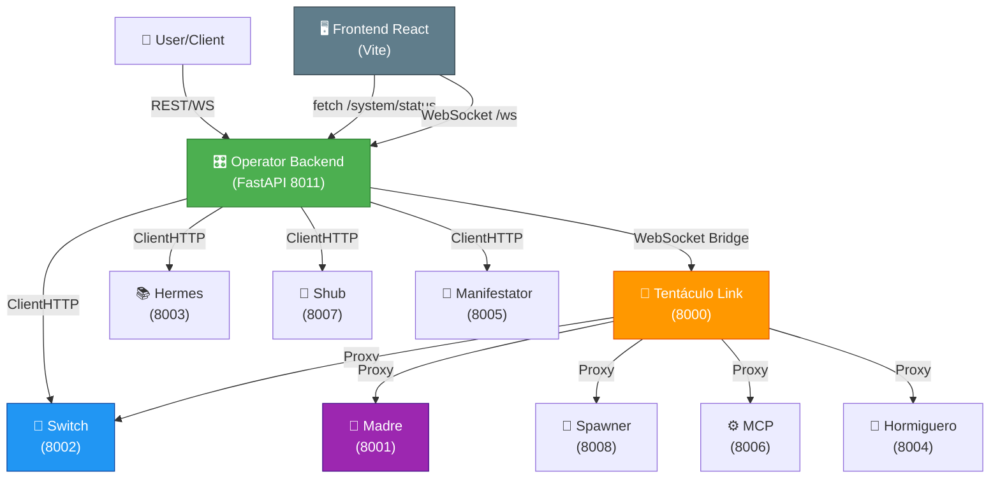
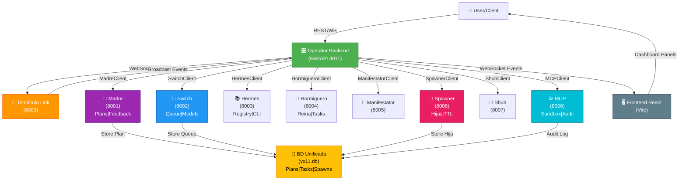
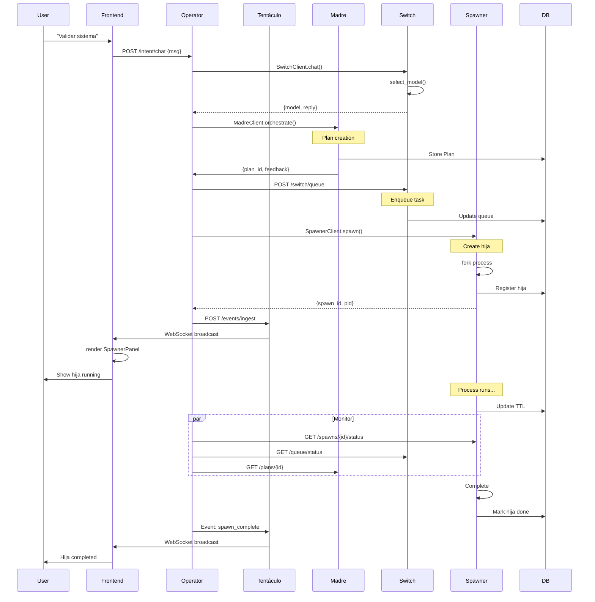
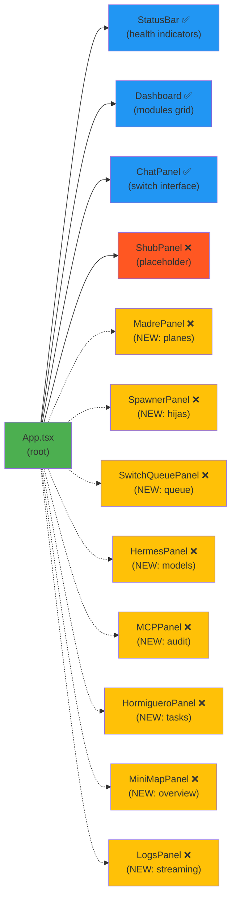
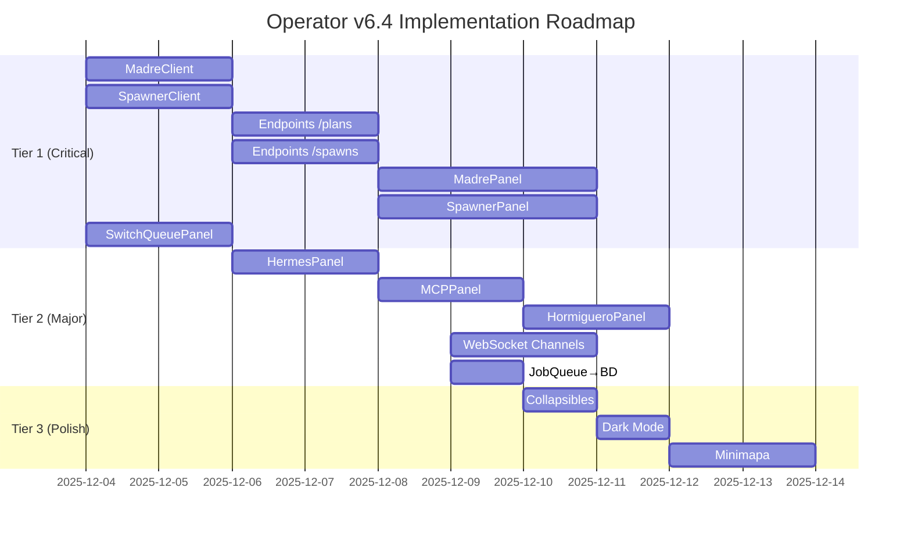
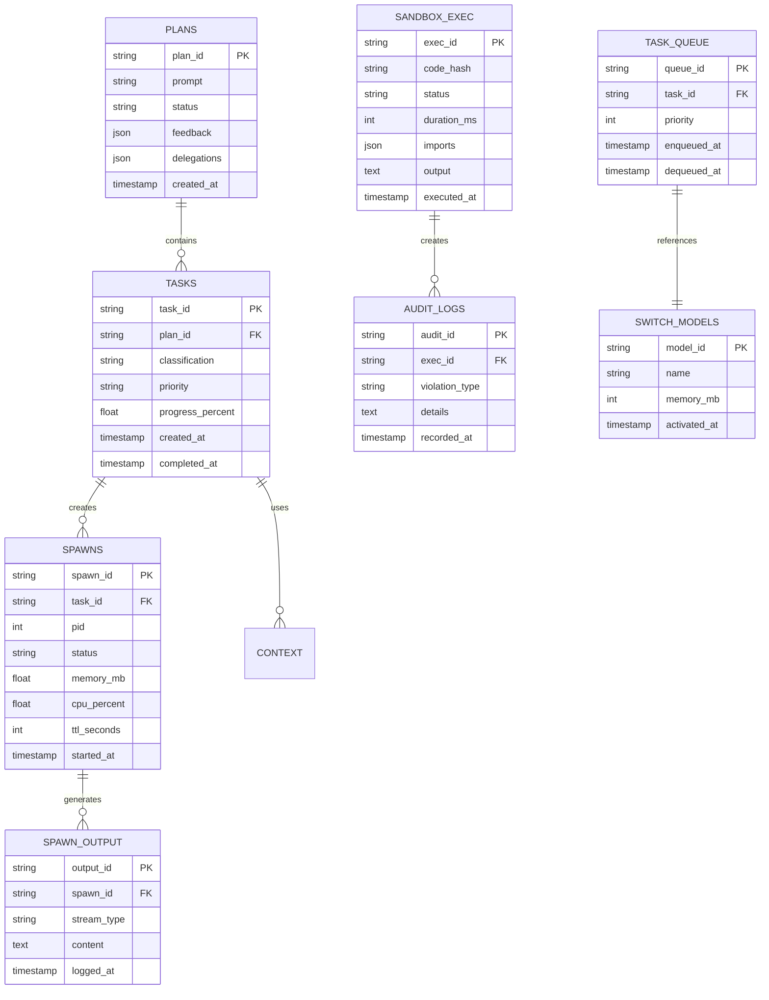
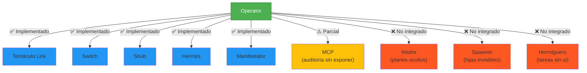

# OPERATOR v6.4 - DIAGRAMA DE ARQUITECTURA Y FLUJOS

**Documento complementario a: `OPERATOR_AUDIT_v6_4.md`**  
Contiene diagramas Mermaid, matrices de decisión y visualización de flujos tentaculares.

---

## 📐 DIAGRAMA 1: ARQUITECTURA ACTUAL vs REQUERIDA

### ACTUAL (Estado real hoy)



### REQUERIDA (v6.4 completo)



---

## 🔄 DIAGRAMA 2: FLUJO ORQUESTACIÓN COMPLETO



---

## 📊 DIAGRAMA 3: ESTADO DE COMPONENTES UI



---

## 🔌 DIAGRAMA 4: ENDPOINTS REQUIRED BY COMPONENT

### MadrePanel Requires

```
GET /plans                    → [{ plan_id, prompt, status, feedback, delegations }]
GET /plans/{plan_id}          → { plan_id, full_detail, steps, results }
POST /plans/{plan_id}/execute → { status: "accepted" }
```

### SpawnerPanel Requires

```
GET /spawns                   → [{ spawn_id, status, pid, memory, cpu, ttl }]
GET /spawns/{id}              → { spawn_id, cmd, status, metrics, logs_tail }
GET /spawns/{id}/logs         → WebSocket stream of stdout/stderr
POST /spawns/{id}/kill        → { status: "terminated" }
GET /spawns/{id}/metrics      → { cpu_percent, memory_mb, uptime_s }
```

### SwitchQueuePanel Requires

```
GET /queue/status             → { size, active_model, mode, next_tasks }
GET /queue/next               → [{ task_id, priority, source, prompt_preview }]
POST /queue/preload/{model}   → { status: "preloading" }
GET /models/active            → { name, memory_mb, loaded_at }
```

### HermesPanel Requires

```
GET /models                   → { local: [...], registry: [...], cli: [...] }
GET /models/local             → [{ name, size_gb, location, loaded }]
GET /models/registry          → [{ name, source, size_gb, available }]
POST /models/download/{name}  → { status: "downloading", progress }
GET /models/{name}/usage      → { memory_mb, last_used, usage_count }
```

### MCPPanel Requires

```
GET /audit/executions         → [{ exec_id, timestamp, status, duration, output }]
GET /audit/violations         → [{ exec_id, violation_type, code_snippet }]
GET /audit/stats              → { total, violations, avg_time_ms, security_score }
GET /audit/executions/{id}    → { full_details, code, imports, audit_log }
```

### HormigueroPanel Requires

```
GET /tasks                    → { pending: [...], in_progress: [...], completed: [...] }
GET /tasks/pending            → [{ task_id, description, classification, priority }]
GET /tasks/{id}               → { task_id, classification, progress_pct, queen_info }
POST /tasks/{id}/priority     → { status: "reprioritized" }
```

---

## 🎯 DIAGRAMA 5: MATRIZ DE IMPLEMENTACIÓN



---

## 💾 DIAGRAMA 6: DATABASE SCHEMA REFERENCE



---

## 🎨 DIAGRAMA 7: LAYOUT SUGERIDO (MOCKUP ASCII)

```
┌─────────────────────────────────────────────────────────────────────────────┐
│ OPERATOR v6.4 Dashboard                                    [≡] [🌙] [⚙️]   │
├─────────────────────────────────────────────────────────────────────────────┤
│ 🟢 Connected | Health: 9/9 ✓ | CPU: 35% | Mem: 2.3/8.0 GB | Uptime: 12:34 │
├─────────────────────────────────────────────────────────────────────────────┤
│ [📋 Plans] [👶 Hijas] [🔀 Queue] [📚 Models] [🔐 Audit] [🐜 Tasks] [🗺️ Map]│
├──────────────────────────────────────┬──────────────────────────────────────┤
│                                      │                                      │
│ 📋 PLANES (Madre)                    │ 👶 HIJAS (Spawner)                   │
│ ┌────────────────────────────────┐   │ ┌────────────────────────────────┐   │
│ │ Plan #1: Validar sistema       │   │ │ [▶] validate.py (pid=1234)     │   │
│ │ Status: executing ▓▓▓░░░░░░░░ │   │ │ CPU: 45% | Mem: 128MB | TTL: 47s│   │
│ │ Feedback: deepseek             │   │ │ [logs] [kill]                   │   │
│ │ Delegations:                   │   │ │                                 │   │
│ │ ├─ [✓] switch (route_v5)       │   │ │ [■] cleanup.py (pid=5678)      │   │
│ │ ├─ [▶] hermes (search)         │   │ │ CPU: 0% | Mem: 64MB | TTL: 120s│   │
│ │ └─ [○] spawner (spawn)         │   │ │ [logs] [kill]                   │   │
│ │                                │   │ │                                 │   │
│ │ [▶] Execute | [📋] Copy ID     │   │ │ [✓] analyze.py (pid=9999)      │   │
│ └────────────────────────────────┘   │ │ Completed 2 minutes ago         │   │
│                                      │ │ [view output]                   │   │
│ 🔀 QUEUE (Switch)                    │ └────────────────────────────────┘   │
│ ┌────────────────────────────────┐   │                                      │
│ │ Active Model: deepseek-r1      │   │ 📚 MODELS (Hermes)                   │
│ │ Memory: ▓▓▓▓▓░░░░░ 5/8 GB      │   │ ┌────────────────────────────────┐   │
│ │ Queue: ▓▓▓░░░░░░░ 12 tasks     │   │ Local (loaded):                 │   │
│ │ Mode: [ECO] BALANCED HIGH-PERF │   │ • mistral-7b [4.2GB] ✓          │   │
│ │                                │   │ • llama-13b [6.0GB] ✓           │   │
│ │ Next tasks:                    │   │ Registry (available):           │   │
│ │ 1. [⚡] shub: audio_track_03   │   │ • deepseek-r1 [7.0GB]           │   │
│ │    est. 2s                     │   │ • mixtral-8x7b [26GB]           │   │
│ │ 2. [⚙️] operator: validate     │   │ [↓ Download] [✕ Unload]         │   │
│ │    est. 5s                     │   │ └────────────────────────────────┘   │
│ │                                │   │                                      │
│ │ [🔄 Reload] [⚙️ Set Model]     │   │ 🔐 AUDIT (MCP)                      │
│ └────────────────────────────────┘   │ ┌────────────────────────────────┐   │
│                                      │ │ Executions: 1024                │   │
│ 📝 LOGS (Streaming)                  │ │ Violations: 3 (violations only) │   │
│ ┌────────────────────────────────┐   │ │ Avg time: 156ms                 │   │
│ │ [INFO]  Madre: plan_created    │   │ │ Security: ★★★★★ 98%           │   │
│ │ [WARN]  Switch: model_loading  │   │ │ Last exec: sha256-abc...        │   │
│ │ [INFO]  Hermes: download_ok    │   │ │ [🔍 Details] [📥 Export]       │   │
│ │ [DEBUG] Spawner: hija_ttl=300  │   │ │ [⚠️ Violations]                 │   │
│ │ [ERROR] MCP: forbidden_import   │   │ └────────────────────────────────┘   │
│ └────────────────────────────────┘   │                                      │
│ [🔍 Filter] [📥 Export]              │ 🐜 TASKS (Hormiguero)                │
│                                      │ ┌────────────────────────────────┐   │
└──────────────────────────────────────┼──────────────────────────────────────┤
│ 🗺️ MINIMAPA (Sistema)                │ Pending: 5 | Running: 3 | Done: 127 │
│ ┌──────────────────────────────────┐ │ [validation] [processing] [done]    │
│ │ ┌─────────┬─────────┬─────────┐  │ │ Reina Classification: enabled       │
│ │ │ Tentác. │ Madre   │ Hormig. │  │ │ Last activity: 2 minutes ago        │
│ │ │ 🟢      │ 🟢      │ 🟢      │  │ │ [↑ Priority] [View Timeline]        │
│ │ ├─────────┼─────────┼─────────┤  │ └────────────────────────────────────┘
│ │ │ Switch  │ Hermes  │ Shub    │  │
│ │ │ 🟢      │ 🟢      │ 🟢      │  │
│ │ ├─────────┼─────────┼─────────┤  │
│ │ │ Spawner │ MCP     │ OperatrI │  │
│ │ │ 🟢      │ 🟡      │ 🟢      │  │
│ │ └─────────┴─────────┴─────────┘  │
│ │ 🟢=ok 🟡=slow 🔴=down            │
│ └──────────────────────────────────┘
│ [💾 Save Layout] [📂 Load Preset] [🌙 Toggle Dark]
└──────────────────────────────────────────────────────────────────────────────┘
```

---

## 🔌 DIAGRAMA 8: WEBSOCKET CHANNEL HIERARCHY

```
WebSocket (/ws)
│
├── system
│   ├── status_update         {modules_health, timestamp}
│   ├── error                 {module, error_msg}
│   └── shutdown              {}
│
├── operator
│   ├── intent_parsed         {intent_type, confidence}
│   ├── job_queued            {job_id, intent}
│   └── job_status            {job_id, status}
│
├── madre
│   ├── plan_created          {plan_id, prompt, feedback}
│   ├── plan_updated          {plan_id, status}
│   ├── delegation_sent        {plan_id, target, action}
│   └── plan_completed        {plan_id, result}
│
├── switch
│   ├── task_queued           {task_id, priority, queue_size}
│   ├── model_switched        {model_name, memory_mb}
│   ├── model_preloading      {model_name, progress}
│   └── response_ready        {task_id, reply}
│
├── spawner
│   ├── spawn_created         {spawn_id, pid, cmd}
│   ├── spawn_status          {spawn_id, status, cpu, memory}
│   ├── spawn_output          {spawn_id, stream_type, data}
│   └── spawn_completed       {spawn_id, exit_code}
│
├── hermes
│   ├── model_download_start  {model_name, size_gb}
│   ├── model_download_progress {model_name, progress_pct}
│   ├── model_loaded          {model_name, memory_mb}
│   └── cli_command_executed  {cmd, result}
│
├── mcp
│   ├── sandbox_exec          {exec_id, code_hash, result}
│   ├── violation_detected    {exec_id, violation_type}
│   └── audit_log_entry       {audit_id, details}
│
└── hormiguero
    ├── task_created          {task_id, classification}
    ├── task_prioritized      {task_id, priority}
    ├── task_completed        {task_id, result}
    └── queen_decision        {task_id, classification_reason}
```

---

## 📊 DIAGRAMA 9: ESTADO DE INTEGRACIÓN POR MÓDULO



---

## 🎯 CONCLUSIÓN DEL DIAGRAMA

La arquitectura actual es **funcional pero esquelética**. Los diagramas muestran:

1. **Tier 1 (Crítico)**: Falta integración Madre, Spawner, visualización de cola
2. **Tier 2 (Mayor)**: Falta paneles Hermes, MCP, Hormiguero
3. **Tier 3 (Mejora)**: Falta UX avanzada (collapsibles, minimapa, dark mode)

**Próximo paso**: Implementar según roadmap en `OPERATOR_AUDIT_v6_4.md`.

