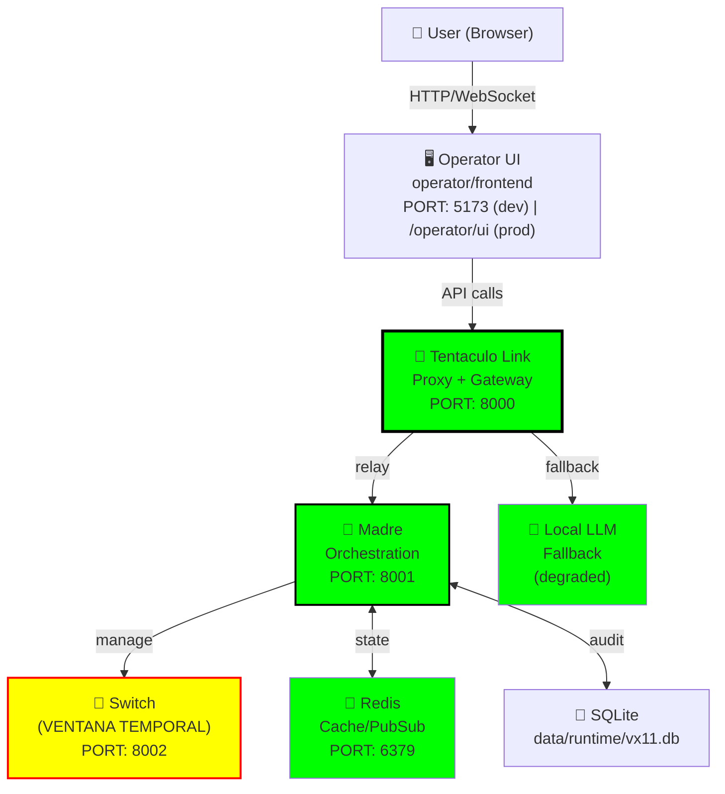
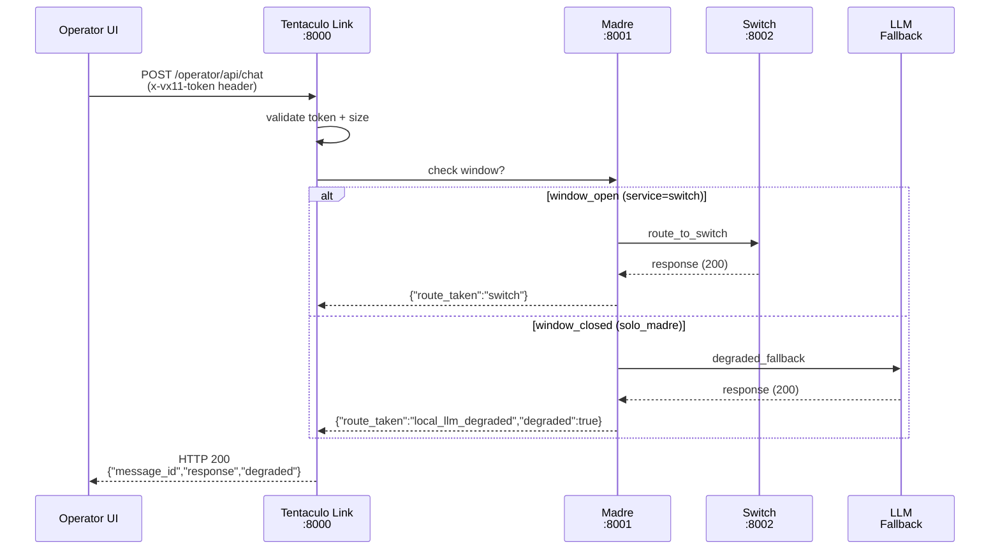
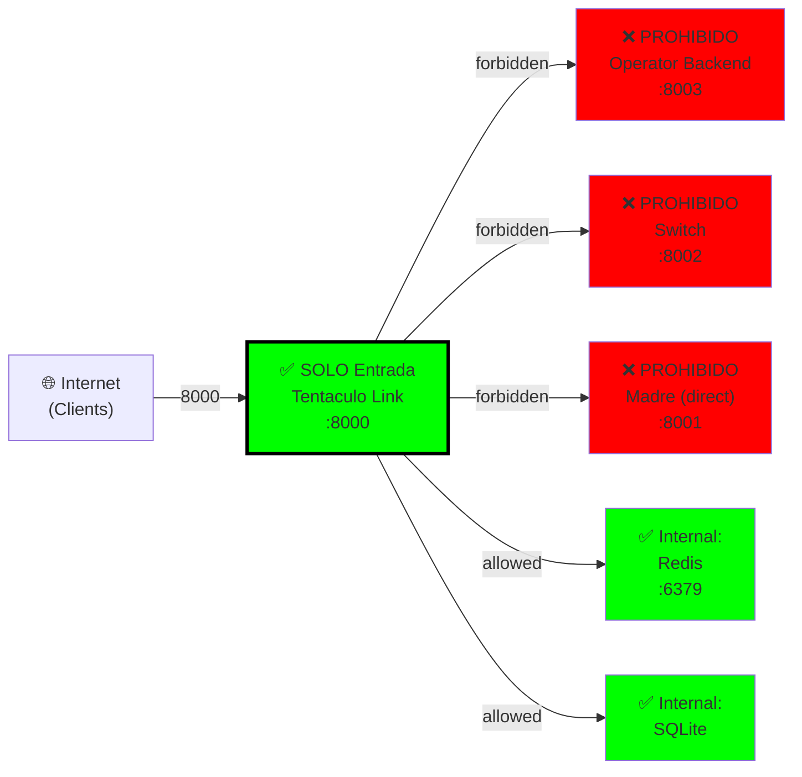
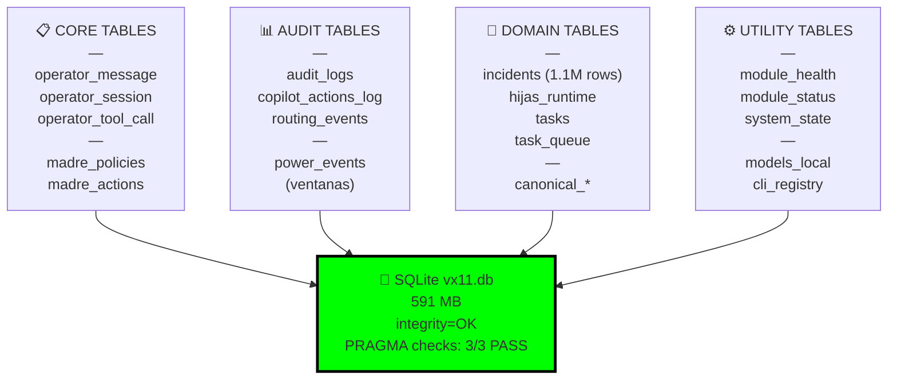
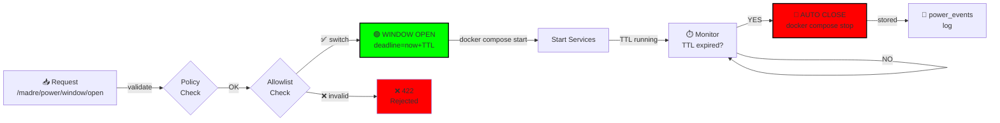
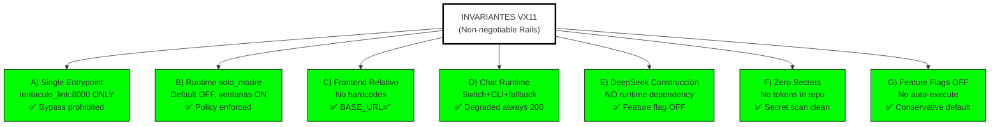

# VX11 — DIAGRAMAS CONTRATO (B) — ARQUITECTURA PRODUCCIÓN

---

## DIAGRAMA 1: Architecture Global (solo_madre policy)



---

## DIAGRAMA 2: Request Flow (Chat Endpoint)



---

## DIAGRAMA 3: Single Entrypoint (Invariante A)



---

## DIAGRAMA 4: Database Schema (71 tablas, integridad OK)



---

## DIAGRAMA 5: Power Windows (Ventana Temporal)



---

## DIAGRAMA 6: Invariantes (NO NEGOCIABLES)



---

## DIAGRAMA 7: Ports Mapeados (solo_madre)

```
┌─────────────────────────────────────┐
│  VX11 SERVICIOS (solo_madre policy) │
├─────────────────────────────────────┤
│ ✅ Tentaculo Link   :8000 (UP)      │
│ ✅ Madre            :8001 (UP)      │
│ ✅ Redis            :6379 (UP)      │
│ ❌ Switch           :8002 (OFF)     │
│ ❌ Operator Backend :8003 (OFF)     │
│ ❌ Operator UI Dev  :5173 (OFF)     │
│ ❌ Hermes           :8004 (OFF)     │
│ ❌ Shubniggurath    :8005 (OFF)     │
└─────────────────────────────────────┘

Nota: Servicios OFF arrancan SOLO en ventanas temporales
```

---

## CONTRATO (Verificaciones Obligatorias)

1. **Arquitectura**: Single entrypoint ✅ (tentaculo only)
2. **Routing**: Chat siempre 200 (degraded fallback) ✅
3. **DB**: Integridad 3/3 PRAGMA checks ✅
4. **Seguridad**: 0 secrets + feature flags OFF ✅
5. **Ventanas**: open/close/TTL funcional ✅
6. **Tests**: 10/10 HTTP 200, degraded flag verificado ✅

---

**Generado**: 2025-12-29T01:10:00Z  
**Status**: ✅ DIAGRAMS CONTRACTE VERIFIED
